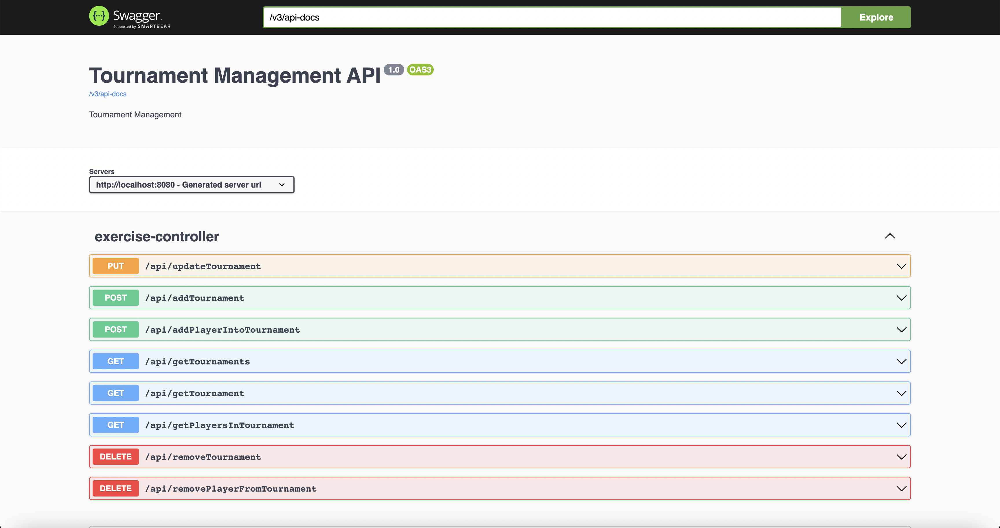

# interview-exercise

This application serves as a Tournament Management Application app wherein tournaments could be created and players added or mapped to the d=created tournaments.

## Prerequisites

- [`Java 11`](https://www.oracle.com/java/technologies/downloads/#java11)
- [`Docker`](https://www.docker.com/)
- [`Docker-Compose`](https://docs.docker.com/compose/install/)

### Getting Started

All the code required to run this project/application is also available in this Git repository. You can either download it as a zip file from Github or run:

```bash
$ git clone https://github.com/babsgenius2001/tournament-management.git
```

### Running the application

If you don't want to go through the process of using an IDE and just want to get the project running to explore it, navigate to the directory where you downloaded the source code and run:

    ```bash
    $ mvn spring-boot:run
    ```
If everything went well, you should be able to access the web app here: http://localhost:8080/api/

A swagger-ui link to test the functionality of the API after running the application is also available via:
* http://localhost:8080/swagger-ui/index.html
  

You can also run the application via docker compose:
* Building Spring Boot & H2 database Image together
> docker-compose up

### CI/CD Pipeline

This application is also enriched with the ability to run through the various stages setup within its <b>build.yml</b> which comprises of the stages of Testing, SonarCloud Analysis, Application build(Docker), Publishing of the image to Docker Registry and Deployment to AWS Elastic BeanStalk.

### Pulling the application from Docker Registry

The application (image) is also available at the docker hub registry. Just run:
> docker pull babsgenius2001/tournament-management:1
